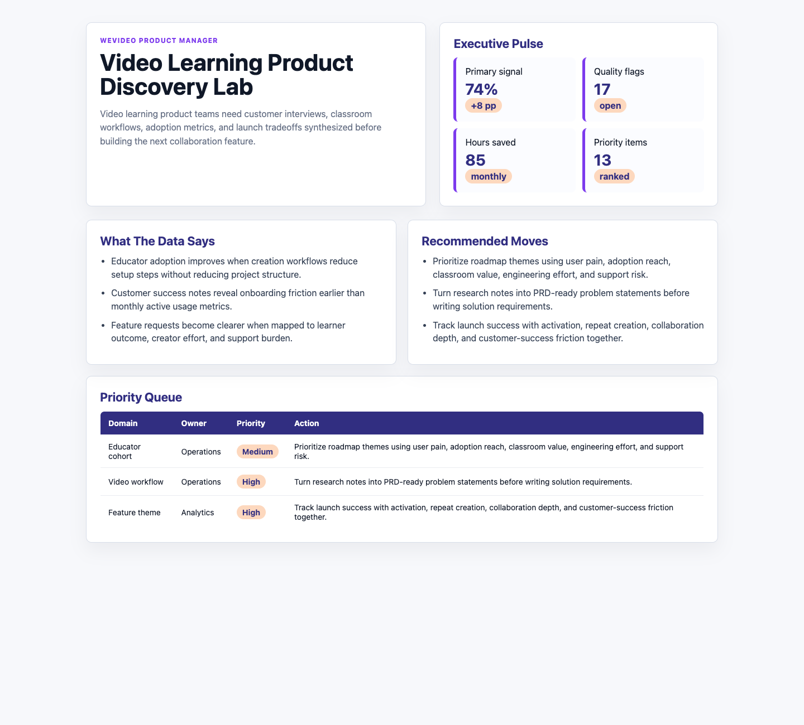

# Video Learning Product Discovery Lab

## Motivation

Video learning product teams need customer interviews, classroom workflows, adoption metrics, and launch tradeoffs synthesized before building the next collaboration feature.

This is a practical decision artifact: it includes data, analysis notes, runnable scoring logic, and a visual dashboard that explains what the operating team should do next.

## What Is In The Project

- Browser dashboard in `index.html`
- Six source-style CSV datasets in `data/`
- Analysis profile and recommendations in `analysis/`
- Reproducible scoring script in `scripts/`
- Data dictionary in `data_dictionary.md`
- Screenshot in `docs/images/dashboard.png`

## Data Inventory

- 2,880 daily metric rows across 120 days
- 720 source-system events
- 80 stakeholder requirements
- 360 data quality checks
- 90 prioritized actions

## What The Data Says

- Educator adoption improves when creation workflows reduce setup steps without reducing project structure.
- Customer success notes reveal onboarding friction earlier than monthly active usage metrics.
- Feature requests become clearer when mapped to learner outcome, creator effort, and support burden.

## Analytical Recommendations

- Prioritize roadmap themes using user pain, adoption reach, classroom value, engineering effort, and support risk.
- Turn research notes into PRD-ready problem statements before writing solution requirements.
- Track launch success with activation, repeat creation, collaboration depth, and customer-success friction together.

## Screenshot



## Run Locally

```bash
python3 -m http.server 4173
```

Then open `http://localhost:4173`.
