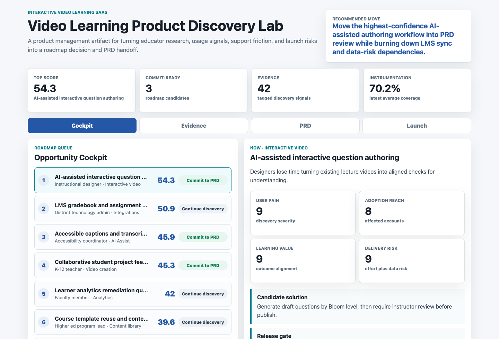
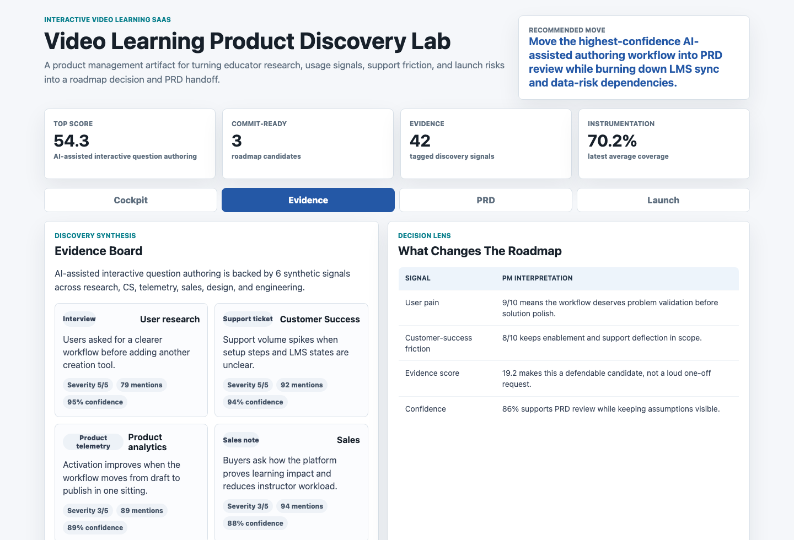
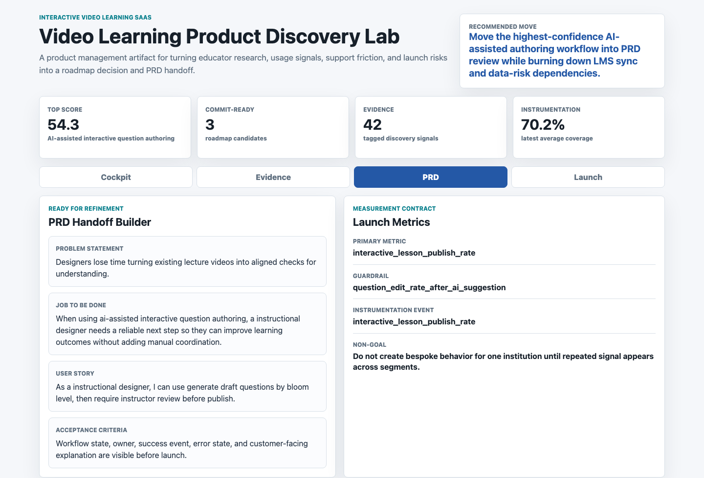
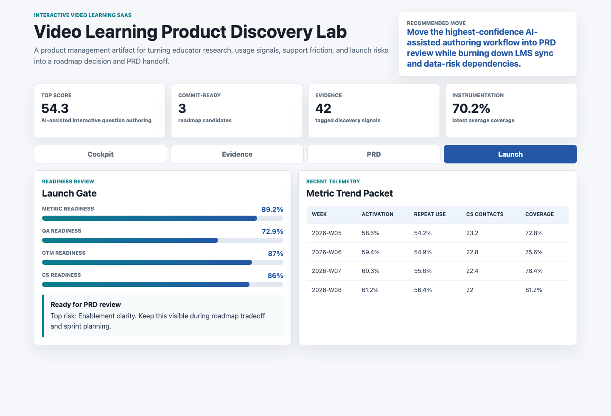

# Video Learning Product Discovery Lab

An interactive product management portfolio artifact for a video learning SaaS platform. The lab shows how a PM can synthesize educator research, instructional-design workflows, product telemetry, customer-success friction, sales feedback, and launch risks into a roadmap decision and PRD-ready engineering handoff.

## Screenshots



The opportunity cockpit ranks product opportunities by user pain, adoption reach, learning value, evidence strength, engineering effort, and data risk. It turns broad customer input into a clear roadmap queue.



The evidence board shows the research and operating signals behind a selected opportunity, including interviews, support tickets, product telemetry, sales notes, usability findings, and engineering release review input.



The PRD handoff builder converts the selected opportunity into a problem statement, job to be done, user story, acceptance criteria, launch metric, guardrail metric, and non-goal.



The launch readiness surface checks metric coverage, QA readiness, go-to-market readiness, customer-success enablement, and recent telemetry before the work moves from PRD review into sprint planning.

## What This Project Demonstrates

- Product discovery synthesis across research, telemetry, support, sales, design, and engineering signals.
- Roadmap prioritization that balances customer pain, adoption reach, learning outcome value, business pull, effort, and data risk.
- PRD writing discipline, including problem framing, user story, acceptance criteria, non-goals, metrics, and Agile handoff status.
- Launch measurement planning with primary metrics, guardrails, instrumentation coverage, QA readiness, and customer-success enablement.
- Reproducible synthetic data generation with transparent assumptions and outputs.

## Data Strategy

All data is deterministic synthetic data generated for a public portfolio artifact. It does not represent real customers, students, teachers, districts, institutions, accounts, support tickets, interviews, product events, revenue, or company performance.

The synthetic structure is modeled on common interactive video learning SaaS workflows:

- Educator and instructional-designer discovery interviews.
- Customer-success tickets and onboarding friction.
- Product telemetry for activation, repeat usage, collaboration, and publishing.
- Sales and buyer feedback around learning impact, integrations, and workflow clarity.
- AI-assisted authoring, caption accessibility, LMS sync, learner analytics, content libraries, and live response workflows.
- PRD handoff artifacts for Agile engineering teams.
- Launch-readiness checks for metrics, QA, go-to-market, and customer success.

The generator uses fixed inputs in `scripts/score_operating_data.py`, so the artifact can be rebuilt and explained consistently.

## Repository Structure

- `data/`: synthetic source-style CSVs for opportunities, discovery signals, weekly product metrics, PRD handoff, and launch readiness.
- `analysis/outputs/`: scored queues and `app_payload.json` used by the front end.
- `analysis/`: methodology, analysis plan, executive findings, and example SQL checks.
- `src/`: static JavaScript and CSS for the interactive product studio.
- `docs/images/`: screenshots of the four artifact surfaces.

## Run Locally

```bash
npm run analyze
npm run start
```

Then open `http://localhost:4173`.

To refresh screenshots after changing the app:

```bash
npm run screenshots
```

## Role Connection

This artifact is designed for a Product Manager role that values customer discovery, user-centric roadmap prioritization, measurable launch goals, Agile handoff, cross-functional alignment, and clear written product thinking. It shows the work behind deciding what to build, not only the final dashboard.

## Scope

This is a public static portfolio artifact, not a production product management system. It does not connect to real LMS platforms, video editors, analytics tools, CRM systems, support systems, AI services, data warehouses, Jira, or private customer data. It shows how a PM can structure discovery evidence, roadmap tradeoffs, PRD handoff, and launch measurement into a defensible workflow before production implementation.
